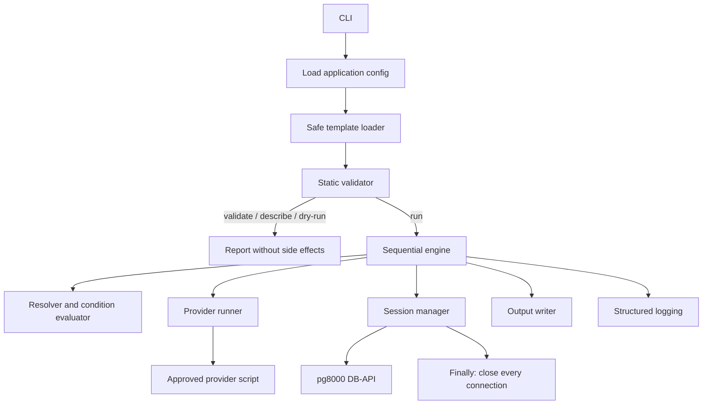

# Architecture

## Scope

DBeeApp is a short-lived, single-process, sequential PostgreSQL workflow runner. Runtime dependencies are vendored pure-Python source under `dbeeapp/_vendor`; the CLI loads them from that local directory and does not install them into the interpreter. No server, pool, scheduler, ORM, worker threads, or background process is part of v1.

The runtime dependency source and required notices ship in the source tree/package. `requirements-runtime.txt` is an exact-pin maintenance manifest for sourcing local wheels only; it is never an installation command. `tools/vendor_runtime.py` extracts package modules, `.dist-info` metadata needed by libraries, and license files, while excluding native extensions.

## Components and Lifecycle

1. Parse CLI arguments and load optional application config.
2. Bootstrap `dbeeapp/_vendor` on `sys.path`, then load exactly one YAML document with safe parsing, aliases/tags rejection, and duplicate-key rejection.
3. Validate version, shape, fields, references, file paths, session/transaction combinations, result and output modes. Validation must not invoke credentials or contact PostgreSQL.
4. For a run only, create the execution context, execute steps in listed order, and write outputs.
5. In a `finally` path, attempt closure of every registered reusable and temporary connection even if one close fails.
6. Emit a stable exit status and secret-free diagnostics.

## Template and Resolver

The v1 resolver accepts only complete scalar references such as `{{ vars.name }}`, `{{ steps.step_id.first.column }}`, and supported result metadata. It does not parse expressions or call functions. SQL values are resolved to Python values and passed in a separate parameter mapping; there is no SQL text substitution. Passwords never enter workflow context. SQL file paths are resolved relative to the template root, canonicalized, and rejected if they escape it.

## Providers

Credential provider IDs are validated simple names and resolved only inside the configured administrator-owned provider directory. Invoke the selected executable as a subprocess using argv (never shell), JSON request on stdin, JSON response on stdout, bounded execution time, and captured stderr that is never copied into user diagnostics. The request contains protocol version, database username, and provider options; the strict response is `{ "version": 1, "password": "..." }`. Nonzero status, timeout, malformed/extra output, invalid UTF-8/JSON, or empty password fail closed. Secret bytes are not logged, included in exceptions, or copied to workflow context.

## Database Sessions

`SessionManager` owns physical connections keyed by database ID. `reuse` opens lazily and returns the same connection for later references, regardless of database switching. `new` opens per operation and closes in a `finally` block without replacing the cached reusable connection. A step-level `new` override leaves an existing reusable connection untouched. Credentials are fetched only when a connection is opened; no password cache is retained deliberately.

A connection failure during/after SQL dispatch makes execution outcome potentially ambiguous: invalidate and close that connection, fail the operation, and never rerun that SQL. Do not silently reconnect a broken reusable session later in the same job. Connection establishment can be classified separately, because SQL has not yet been dispatched.

## Transaction Lifecycle

The pg8000 DB-API defaults to autocommit off. DBeeApp commits each successful standalone SQL step on a reused connection, and rolls back a failed step where the connection remains usable; this keeps each operation's transaction independent of session lifetime. SQL sessions may retain temporary tables and persistent `SET` state across statements despite commit. Per-step `statement_timeout` is set transaction-locally, so it does not leak into later transactions on the reused session.

An explicit transaction step uses one connection, begins one DB-API transaction, runs only direct child SQL steps against the same database/connection, and commits once after all succeed. Any child failure triggers best-effort rollback and suppresses all later children. A connection loss or ambiguous commit failure ends the group in failure; a replacement connection never continues it. Inputs that request output/session overrides or nested transaction/other-database children are rejected unless specifically allowed by the v1 spec.

## Results and Memory

`none`, `scalar`, `first`, and `rows` provide bounded materialization. `rows` enforces configured row/byte ceilings and fails rather than silently truncating. `stream` uses an internally named PostgreSQL `NO SCROLL` cursor and bounded `FETCH FORWARD` batches because pg8000 DB-API `execute()` buffers its result context before ordinary `fetchmany()` calls. Stream queries must be row-returning SELECT statements and be consumed by the immediately following CSV/JSONL output step on the same reusable session. Metadata and explicitly named `set` values are retained in the job context; passwords and raw provider responses are not.

## Output, Logging, and Cleanup

Output formatting is separate from SQL execution and supports stdout or configured files. Overwrite should use a same-directory temporary file plus atomic replace where platform/filesystem semantics allow; append is not atomic. Output paths are validated before execution and filesystem ownership/permissions remain an administrator responsibility. Logging includes timestamps, job/step/database IDs, status, duration, and error category, never SQL parameter values or provider output. Cleanup attempts all connections independently.

## Research Sources

- pg8000 project documentation / PyPI: DB-API parameter styles, autocommit, cursors, SSL context, and error behavior.
- PostgreSQL 18 documentation, “Transactions”: implicit per-statement transactions and atomic transaction blocks.
- Python 3 subprocess documentation: argv sequence, `shell=False`, pipes, timeout and child-process cleanup.
- PyYAML documentation: use `safe_load` / SafeLoader for untrusted YAML.
- CyberArk AIM public documentation URL attempted but returned 404; provider endpoint contract remains subject to version-specific confirmation.
