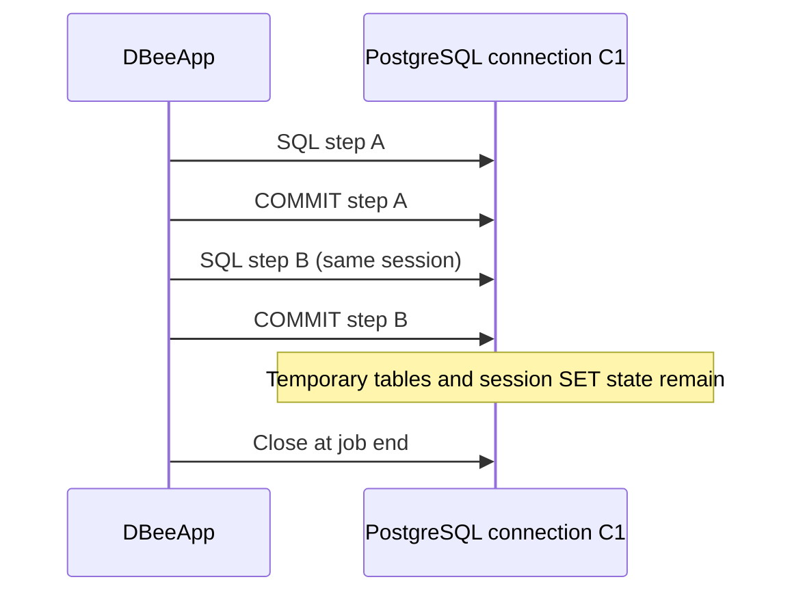

# Database Sessions

## Session Is Not Transaction

A PostgreSQL session is one physical client/server connection and retains connection-local state such as temporary tables and `SET` values. A transaction is a unit of atomic database work within a session. Committing one SQL step does not close the session or erase its temporary tables/session settings.

## `reuse`

`reuse` is the default. A connection is opened lazily on first use and retained until job cleanup. The registry has at most one reusable connection per database ID; switching databases does not discard another database's connection.

```text
step1 -> control: open C1
step2 -> reporting: open R1
step3 -> control: reuse C1
step4 -> reporting: reuse R1
job end: close C1 and R1
```

Each standalone SQL step has its own transaction boundary. A successful step commits; a failed step rolls back where possible. A sequence of reusable-session steps is not automatically one atomic transaction.

## `new` and Step Overrides

`session.mode: new` opens a fresh connection for one SQL operation and closes it after transaction handling. It is never placed in the reusable registry. If a database defaults to reuse, a step-level `session: {mode: new}` uses a separate connection and leaves the earlier reusable connection intact; later default steps resume on that earlier connection.

`new` steps must not depend on temporary tables or session-level settings established by another step. A transaction group has exactly one connection and does not allow child session overrides.

## State and Credential Lifetime

Under reuse, state intentionally remains available:

```yaml
- id: create_temp
  type: sql
  db: control
  sql: CREATE TEMP TABLE work_items (id integer)
- id: read_temp
  type: sql
  db: control
  sql: SELECT * FROM work_items
```

The first use retrieves a password, establishes the connection, and discards the password reference as soon as practical. `new` retrieves credentials for each new connection. DBeeApp does not cache credentials. Passwords are not exposed through result state or templates.

`result.mode: stream` uses a PostgreSQL server-side cursor and therefore requires a reusable session until the adjacent CSV/JSONL output step drains or closes it.

## Failures and Reconnection

A connect failure before SQL dispatch is distinct from a connection failure during execution. Once a statement may have been sent, outcome can be ambiguous; DBeeApp fails without replaying it. A broken reused connection is invalidated and closed best-effort. The v1 run fails rather than silently opening a replacement for a later step, which could lose session state and change semantics. A connection loss inside a transaction group fails the group; no reconnect, new transaction, or later child execution occurs.

## Cleanup

All connections are closed on success, step failure, provider/output error, validation/runtime exception, and keyboard interruption where the process can handle it. Failure closing one connection does not stop attempts to close others. Temporary `new` connections close in per-operation `finally` blocks.

## Session vs Transaction Diagram


